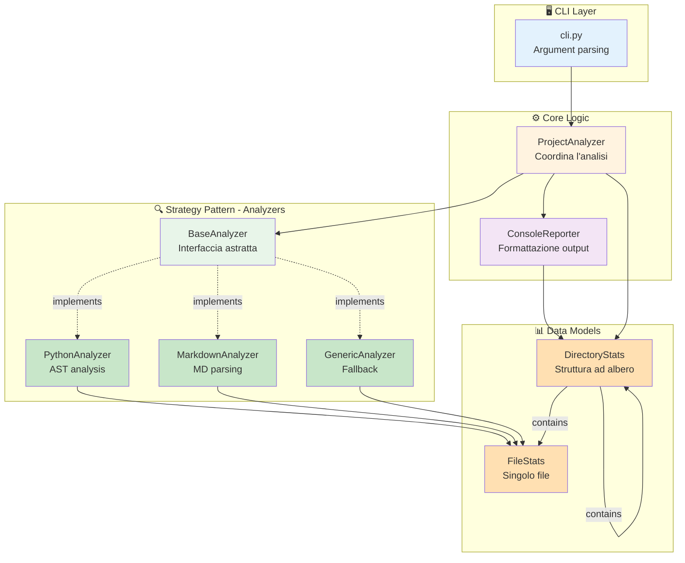

# 📊 CodeStat - Project Analyzer

[](https://www.python.org/downloads/)
[](https://opensource.org/licenses/Apache-2.0)

**CodeStat** è uno strumento da riga di comando per analizzare e generare statistiche dettagliate su progetti software. Fornisce agli sviluppatori una panoramica completa e immediata della struttura, dimensione e composizione del loro codice.

## 🎯 Caratteristiche Principali

- **🌍 Multi-Linguaggio**: Supporta Python, JavaScript, TypeScript, Java, C++, Go, Rust, Ruby, PHP e molti altri
- **🧠 Analisi Intelligente**: Distingue tra codice, commenti e righe vuote
- **🐍 Analisi Avanzata Python**: Usa AST per estrarre docstring, classi e funzioni senza eseguire codice
- **📁 Vista Gerarchica**: Mostra statistiche organizzate per directory
- **🎨 Output Formattato**: Report con emoji e struttura chiara
- **⚡ Esclusione Automatica**: Ignora directory comuni come `node_modules`, `venv`, `.git`

## 📦 Installazione

### Da Sorgente (Sviluppo)

```bash
# Clone la repository
git clone https://github.com/lucadileo9/codestat.git
cd codestat

# Crea ambiente virtuale
python -m venv venv
source venv/bin/activate  # Su Windows: venv\Scripts\activate

# Installa in modalità sviluppo
pip install -e .
```

### Da PyPI (Futuro)

```bash
pip install codestat
```

## 🚀 Utilizzo

### Analisi Base

```bash
# Analizza la directory corrente
codestat

# Analizza una directory specifica
codestat /path/to/your/project

# Analizza solo certi tipi di file
codestat --ext .py --ext .js

# Output compatto (senza dettagli file)
codestat --quiet
```

### Esempi di Output

```
📊 Project Analysis
━━━━━━━━━━━━━━━━━━━━━━━━━━━━━━━━━━━━━━━━━━━━━━━━━━━

📁 src/project_analyzer/
  │
  ├── 📄 core.py
  │     Lines: 245 | Code: 180 | Comments: 45 | Blank: 20
  │     🐍 Classes: 1 | Functions: 8 | Docstring: ✓
  │
  ├── 📄 models.py
  │     Lines: 98 | Code: 75 | Comments: 15 | Blank: 8
  │     🐍 Classes: 2 | Functions: 6 | Docstring: ✓
  │
  └── 📁 analyzers/
        ├── 📄 python.py
        │     Lines: 156 | Code: 120 | Comments: 25 | Blank: 11
        └── 📄 generic.py
              Lines: 89 | Code: 65 | Comments: 18 | Blank: 6

━━━━━━━━━━━━━━━━━━━━━━━━━━━━━━━━━━━━━━━━━━━━━━━━━━━
📈 Summary
━━━━━━━━━━━━━━━━━━━━━━━━━━━━━━━━━━━━━━━━━━━━━━━━━━━

Total Files: 15
Total Lines: 1,234
  ├── Code: 890 (72.1%)
  ├── Comments: 234 (19.0%)
  └── Blank: 110 (8.9%)

🐍 Python Specifics:
  ├── Classes: 12
  └── Functions: 67
```

## 📁 Struttura del Progetto

```
codestat/
├── src/
│   └── project_analyzer/
│       ├── __init__.py
│       ├── __main__.py
│       ├── models.py          # Strutture dati
│       ├── core.py            # Logica principale
│       ├── cli.py             # Interfaccia CLI
│       ├── reporters.py       # Formattazione output
│       └── analyzers/
│           ├── __init__.py
│           ├── base.py        # Classe astratta
│           ├── python.py      # Analyzer Python
│           └── generic.py     # Analyzer generico
├── tests/
├── pyproject.toml
├── README.md
└── LICENSE
```

## 🏗️ Architettura

CodeStat utilizza un'architettura modulare basata sul **Strategy Pattern** per gestire diversi tipi di file:



### Flusso di Esecuzione

1. **CLI** riceve comandi e opzioni dall'utente
2. **ProjectAnalyzer** scandisce ricorsivamente le directory
3. Per ogni file, seleziona l'**Analyzer** appropriato (Python, Markdown, o Generic)
4. Ogni analyzer produce un **FileStats**
5. Le statistiche vengono aggregate in una struttura **DirectoryStats** ad albero
6. **ConsoleReporter** formatta e visualizza i risultati


## 🛠️ Linguaggi Supportati

| Linguaggio | Estensioni | Analisi Avanzata |
|-----------|-----------|-----------------|
| Python | `.py` | ✅ AST-based |
| JavaScript | `.js`, `.jsx` | 📝 Planned |
| TypeScript | `.ts`, `.tsx` | 📝 Planned |
| Java | `.java` | ❌ |
| C/C++ | `.c`, `.cpp`, `.h`, `.hpp` | ❌ |
| Go | `.go` | ❌ |
| Rust | `.rs` | ❌ |
| Ruby | `.rb` | ❌ |
| PHP | `.php` | ❌ |
| C# | `.cs` | ❌ |
| Swift | `.swift` | ❌ |
| Kotlin | `.kt`, `.kts` | ❌ |

## 🤝 Contribuire

Contributi, issue e feature request sono benvenuti!

1. Fork del progetto
2. Crea un branch per la feature (`git checkout -b feature/AmazingFeature`)
3. Commit delle modifiche (`git commit -m 'Add some AmazingFeature'`)
4. Push al branch (`git push origin feature/AmazingFeature`)
5. Apri una Pull Request

## 📄 Licenza

Distribuito sotto licenza MIT. Vedi `LICENSE` per maggiori informazioni.

## 👤 Autore

**lucadileo9**

- GitHub: [@lucadileo9](https://github.com/lucadileo9)

## ⭐ Supporto

Se questo progetto ti è stato utile, considera di dargli una stella ⭐!

---

*Creato con ❤️ per la community degli sviluppatori*
