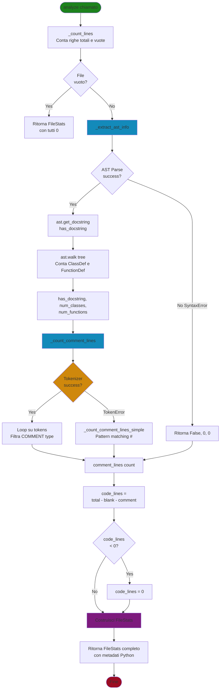

# 🐍 PythonAnalyzer - Analisi Avanzata Python

**Pattern:** Strategy Pattern + AST Parsing  
**File:** `src/project_analyzer/analyzers/python.py`

---

## 🎯 Scopo

Analizza codice Python con **precisione ~98%** usando tecniche avanzate:
- **AST** (Abstract Syntax Tree) per metadati strutturali
- **Tokenizer** per rilevamento preciso dei commenti

**Nessuna esecuzione del codice** → Analisi statica sicura.

---

## 🧠 Tecnologie Usate

### **1. AST (Abstract Syntax Tree)**

**Cosa fa:**
- Rappresenta il codice come albero sintattico
- Analisi **statica** (senza eseguire)
- Estrae strutture: classi, funzioni, docstring

**Esempio:**
```python
# Codice
def greet(name):
    """Say hello."""
    return f"Hi, {name}"
```

**AST:**
```
FunctionDef
├── name: 'greet'
├── args: ['name']
├── body:
│   ├── Expr (docstring)
│   │   └── Constant("Say hello.")
│   └── Return
```

---

### **2. Tokenizer**

**Cosa fa:**
- Divide codice in token lessicali
- Rileva commenti con precisione
- Gestisce edge cases (# in stringhe, commenti inline)

**Esempio:**
```python
x = 5  # Commento inline
```

**Token:**
```
NAME     'x'
OP       '='
NUMBER   '5'
COMMENT  '# Commento inline'  ← Rilevato!
```

---

## 🏗️ Architettura

```
PythonAnalyzer
├── _extract_ast_info()      → Docstring, Classi, Funzioni
├── _count_comment_lines()   → Commenti precisi (tokenizer)
├── _count_comment_lines_simple() → Fallback se tokenizer fallisce
└── analyze()                → Orchestrazione completa
```

### Flusso di Analisi Python




## 📋 Proprietà

### **1. `supported_extensions`**

```python
@property
def supported_extensions(self) -> Set[str]:
    return {'.py', '.pyw', '.pyi'}
```

**Estensioni:**
- `.py` - File Python standard
- `.pyw` - Python Windows (senza console)
- `.pyi` - Stub files (type hints)

---

### **2. `language_name`**

```python
@property
def language_name(self) -> str:
    return "Python"
```

---

## 🔧 Metodi Privati

### **1. `_extract_ast_info(file_path)` - Analisi AST**

**Ritorna:** `(has_docstring, num_classes, num_functions)`

**Flusso:**
```
1. Leggi file sorgente
2. Parse AST: tree = ast.parse(source)
3. Estrai docstring: ast.get_docstring(tree)
4. Conta classi e funzioni: ast.walk(tree)
5. Ritorna risultati
```

**Codice chiave:**
```python
# Parse AST
tree = ast.parse(source, filename=str(file_path))

# Docstring del modulo
has_docstring = ast.get_docstring(tree) is not None

# Conta strutture
num_classes = 0
num_functions = 0

for node in ast.walk(tree):
    if isinstance(node, ast.ClassDef):
        num_classes += 1
    elif isinstance(node, (ast.FunctionDef, ast.AsyncFunctionDef)):
        num_functions += 1
```

**Esempio:**
```python
# File: models.py
"""Modelli dati."""  # ← Docstring

class User:          # ← Classe 1
    def __init__(self):  # ← Funzione 1
        pass
    
    def greet(self):     # ← Funzione 2
        pass

async def fetch():   # ← Funzione 3
    pass

# Risultato:
# has_docstring = True
# num_classes = 1
# num_functions = 3 (include metodi!)
```

**Gestione errori:**
```python
except (SyntaxError, UnicodeDecodeError):
    return False, 0, 0  # File con errori
except Exception:
    return False, 0, 0  # Altri problemi
```

---

### **2. `_count_comment_lines(file_path)` - Tokenizer**

**Perché più preciso del pattern matching:**
- ✅ Rileva commenti inline
- ✅ Ignora `#` dentro stringhe
- ✅ Gestisce edge cases complessi

**Codice:**
```python
with open(file_path, 'rb') as f:  # Modalità binaria
    tokens = tokenize.tokenize(f.readline)
    comment_lines = set()  # Set per evitare duplicati
    
    for tok in tokens:
        if tok.type == tokenize.COMMENT:
            comment_lines.add(tok.start[0])  # Numero di riga
    
    return len(comment_lines)
```

**Token structure:**
```python
Token(
    type=COMMENT,
    string='# Commento',
    start=(5, 10),   # (riga, colonna)
    end=(5, 20),
    line='x = 5  # Commento\n'
)
```

**Esempio:**
```python
# File
x = 5  # Commento inline
# Commento intero
url = "http://example.com"  # Non confonde # nella stringa!

# Token COMMENT rilevati:
# - Riga 1: '# Commento inline'
# - Riga 2: '# Commento intero'
# - Riga 3: Niente (# è in STRING token)

# Risultato: 2 righe con commenti
```

**Fallback se tokenizer fallisce:**
```python
except (tokenize.TokenError, UnicodeDecodeError):
    return self._count_comment_lines_simple(file_path)
```

---

### **3. `_count_comment_lines_simple(file_path)` - Fallback**

**Metodo semplice** quando il tokenizer non può funzionare (file con errori di sintassi).

```python
def _count_comment_lines_simple(self, file_path: Path) -> int:
    with open(file_path, 'r', encoding='utf-8') as f:
        lines = f.readlines()
    
    comment_count = 0
    for line in lines:
        if line.strip().startswith('#'):
            comment_count += 1
    
    return comment_count
```

**Limitazioni:**
- ❌ Non rileva commenti inline
- ❌ Meno preciso
- ✅ Ma meglio di niente!

---

## 🎯 Metodo Principale: `analyze(file_path)`

**Flusso completo:**

```
1. Conta righe base (totali, vuote)
   └─> _count_lines(file_path)

2. Caso edge: file vuoto?
   └─> Ritorna FileStats con zeri

3. Estrai metadati AST
   └─> _extract_ast_info(file_path)
   └─> Ottieni: has_docstring, num_classes, num_functions

4. Conta commenti precisi
   └─> _count_comment_lines(file_path)
   └─> Usa tokenizer (fallback se fallisce)

5. Calcola codice
   └─> code_lines = total - blank - comment

6. Sanity check
   └─> if code_lines < 0: code_lines = 0

7. Ritorna FileStats completo
   └─> Include metadati Python specifici
```

---

## 🎨 Differenza con GenericAnalyzer

### **Caso 1: Docstring**

```python
"""
Questo è un modulo.
"""
```

| Analyzer | Risultato |
|----------|-----------|
| **Generic** | 3 righe commento ❌ |
| **Python** | 3 righe codice ✅ (docstring = documentazione eseguibile) |

---

### **Caso 2: Commenti Inline**

```python
x = 5  # Commento
```

| Analyzer | Risultato |
|----------|-----------|
| **Generic** | 1 riga codice ❌ (non rileva commento) |
| **Python** | 1 riga codice + 1 commento ✅ |

---

### **Caso 3: Stringhe Multi-linea**

```python
x = """
Stringa
multi-linea
"""
```

| Analyzer | Risultato |
|----------|-----------|
| **Generic** | 4 righe commento ❌ |
| **Python** | 4 righe codice ✅ (è una stringa assegnata) |

---
## ⚠️ Limitazioni

### ❌ **1. Metodi Contati Come Funzioni**
```python
class User:
    def __init__(self):  # ← Conta come funzione
        pass
    
    def greet(self):     # ← Conta come funzione
        pass

# num_functions = 2 (include metodi!)
```

**Possibile miglioramento futuro:** Distinguere metodi da funzioni standalone, ma a dire il vero va bene così,
tutto sommato i metodi sono funzioni definite dall'utente, quindi ha senso contarli.

---

### ❌ **2. Codice Commentato**
```python
# def unused():
#     return 42

# Conta come commento, ma è codice commentato
# Impossibile distinguere senza analisi semantica
```

---

## 🔑 Concetti Chiave

| Concetto | Spiegazione |
|----------|-------------|
| **AST** | Albero sintattico astratto - rappresentazione strutturale |
| **Tokenizer** | Divide codice in token lessicali |
| **Static Analysis** | Analisi senza esecuzione del codice |
| **Docstring** | Stringa documentazione (conta come codice) |
| **ast.walk()** | Visita ricorsiva di tutti i nodi AST |

---

## 📚 Riferimenti

- [ast - Python Docs](https://docs.python.org/3/library/ast.html)
- [tokenize - Python Docs](https://docs.python.org/3/library/tokenize.html)
- [PEP 257 - Docstring Conventions](https://peps.python.org/pep-0257/)
- [Documentazione Models](../models.md)
