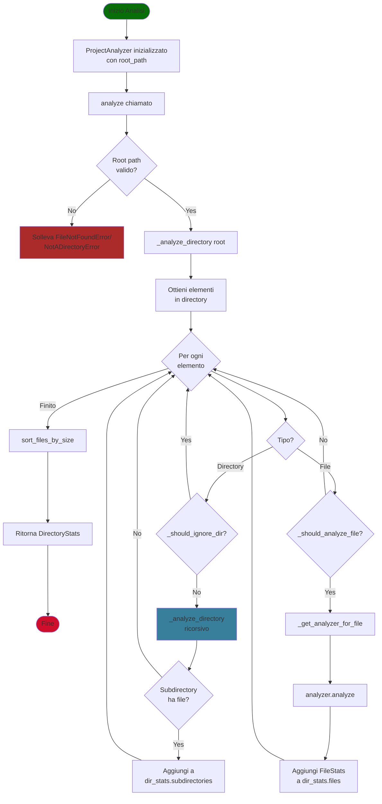
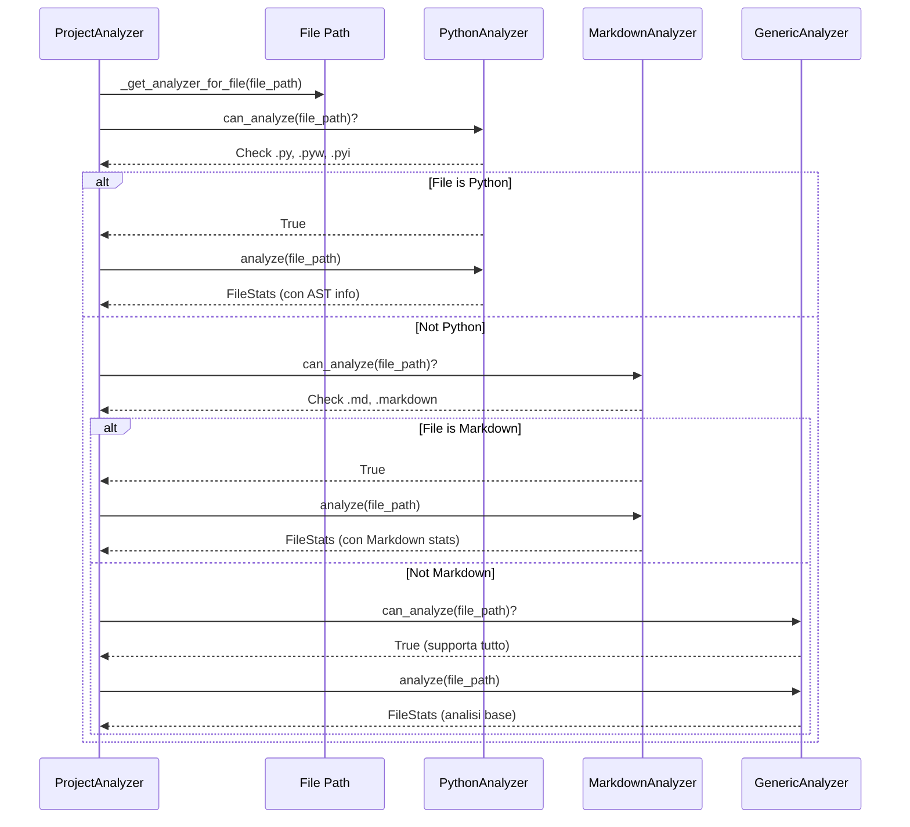

# Modulo core: ProjectAnalyzer

Questa pagina documenta la classe `ProjectAnalyzer` e le sue funzionalità principali, che costituiscono il cuore logico dell'analisi dei progetti in `codestat`.

## Scopo del modulo

Il modulo `core.py` fornisce la logica centrale per l'analisi ricorsiva di progetti software. Coordina gli analyzer specifici per linguaggio, gestisce la scansione delle directory e costruisce la struttura dati delle statistiche del progetto.

## Flusso di Analisi

Il seguente diagramma illustra il flusso completo dell'analisi del progetto:



## Classe principale: `ProjectAnalyzer`

### Responsabilità
- Scansione ricorsiva delle directory di progetto
- Selezione automatica dell'analyzer più adatto per ogni file
- Filtraggio di directory e file da ignorare (es. build, cache, VCS, ecc.)
- Costruzione della struttura ad albero delle statistiche (`DirectoryStats`)

### Inizializzazione
```python
ProjectAnalyzer(
    root_path: Path,
    file_extensions: Optional[Set[str]] = None,
    ignore_dirs: Optional[Set[str]] = None
)
```
- **root_path**: directory radice del progetto da analizzare
- **file_extensions**: set di estensioni da considerare (es. `{'.py', '.js'}`), opzionale
- **ignore_dirs**: directory aggiuntive da ignorare, opzionale

### Metodi principali

#### `analyze()`
Analizza ricorsivamente il progetto a partire dalla root, restituendo una struttura `DirectoryStats` con tutte le statistiche raccolte.

#### `get_supported_extensions()`
Restituisce l'insieme delle estensioni file supportate dagli analyzer disponibili.

### Filtri e regole di esclusione
- Directory ignorate: vedi costante `IGNORED_DIRS` (es. `venv`, `.git`, `node_modules`, ecc.)
- File ignorati: vedi costante `IGNORED_FILES` (es. `.DS_Store`, `*.pyc`, ecc.)
- File nascosti e directory nascoste vengono esclusi automaticamente

### Selezione degli analyzer
Il modulo utilizza una lista di analyzer (es. `PythonAnalyzer`, `GenericAnalyzer`) e seleziona automaticamente quello più adatto per ogni file tramite il metodo `can_analyze`.

#### Diagramma di Selezione Analyzer



### Esempio d'uso
```python
from project_analyzer.core import ProjectAnalyzer
from pathlib import Path

analyzer = ProjectAnalyzer(root_path=Path('.'))
stats = analyzer.analyze()
print(stats.summary())
```

## Dipendenze
- `project_analyzer.models` (FileStats, DirectoryStats)
- `project_analyzer.analyzers` (PythonAnalyzer, GenericAnalyzer, BaseAnalyzer)

## Note
- In caso di errori nell'analisi di un file, viene stampato un warning ma l'analisi prosegue.
- Le statistiche finali sono ordinate per dimensione dei file.

---

Per dettagli sulle statistiche e i modelli dati, vedi la documentazione di [`models.md`](models.md).
